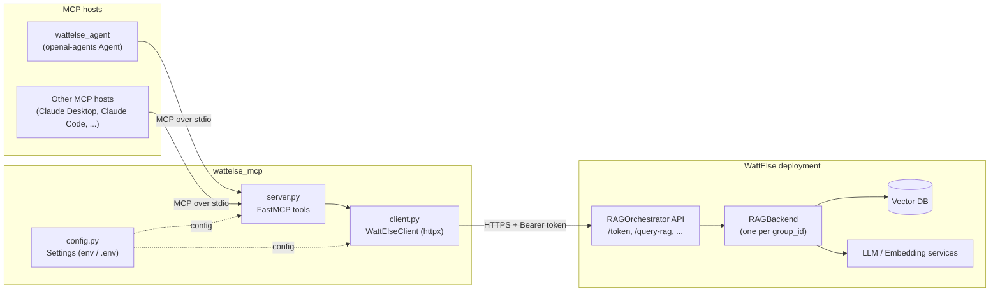
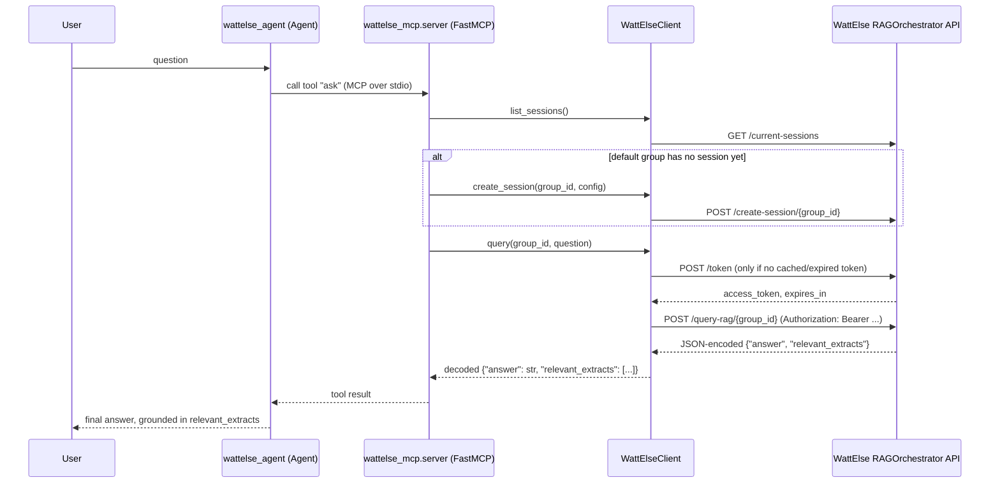

# Architecture

## Overview

This repository has two layers, kept deliberately separate:

- **`wattelse_mcp`** — an MCP server that owns all WattElse-specific integration logic (OAuth2
  client-credentials auth, session/document/query endpoints, response parsing). It exposes that
  logic as MCP tools over stdio, using the official `mcp` package's `FastMCP`.
- **`wattelse_agent`** — an [OpenAI Agents SDK](https://github.com/openai/openai-agents-python)
  agent that mounts `wattelse_mcp` as its only tool source, via `MCPServerStdio`. It never talks to
  WattElse's HTTP API directly.

Because the WattElse integration lives entirely behind the MCP boundary, `wattelse_mcp` can be
mounted by any other MCP host (Claude Desktop, Claude Code, a different agent framework) with zero
code changes — `wattelse_agent` is just one consumer among many.

## Components

| File | Responsibility |
|---|---|
| `wattelse_mcp/config.py` | `pydantic-settings` `Settings`, read from `WATTELSE_*` env vars / `.env` |
| `wattelse_mcp/client.py` | `WattElseClient`: async `httpx` wrapper around the WattElse `RAGOrchestrator` API — token caching, one method per endpoint, response (de)serialization |
| `wattelse_mcp/server.py` | `FastMCP` instance; one `@mcp.tool()` per `WattElseClient` method, plus the `ask` convenience tool |
| `wattelse_agent/agent.py` | Builds an `Agent` + `MCPServerStdio` pointing at `python -m wattelse_mcp.server` |
| `wattelse_agent/cli.py` | Interactive REPL driving that agent with `Runner` |

## Request flow: answering a question

`ask` is the convenience tool most callers use — it hides session bookkeeping behind a single call.
`query_rag` follows the same path minus the session lookup/creation step.

## Auth

`WattElseClient` mirrors WattElse's own client-credentials flow: `client_id`/`client_secret` are
sent as `username`/`password` to `POST /token`, the returned bearer token is cached in memory and
transparently refreshed shortly before `expires_in` elapses. `/health` and `/current-sessions` are
called without a token, matching how the upstream API leaves them unauthenticated.

## Deployment notes

- `wattelse_mcp.server` is a plain stdio MCP server (`python -m wattelse_mcp.server`) — it can be
  registered in any MCP host's config (e.g. Claude Desktop's `claude_desktop_config.json`) the same
  way `wattelse_agent` launches it.
- `upload_documents` takes filesystem paths that must be readable by whichever process is running
  `wattelse_mcp.server` — for a remote agent host, that means files need to be staged on that host
  first, not on the machine driving the conversation.
- All group/session state lives server-side in WattElse; `wattelse_mcp` is stateless and can be
  restarted freely.
